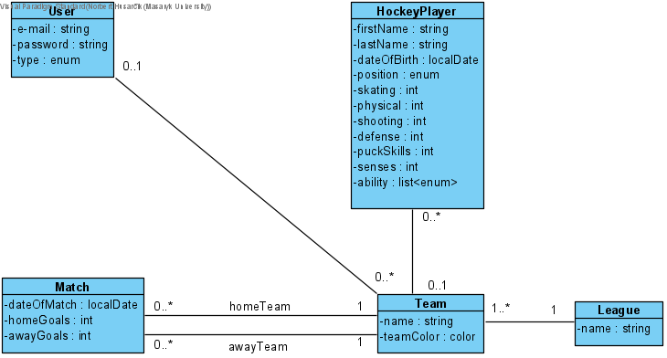
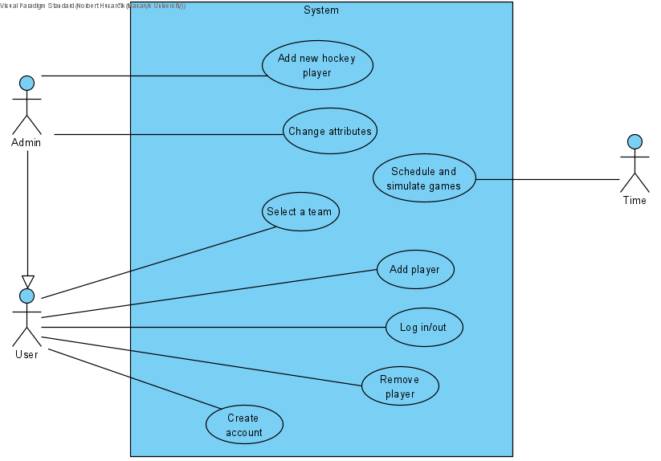

# PA165 - Ice Hockey Manager

This application consists of several executable modules:
- `core`: The core module provides the basic functionality required for the application to function, such as user authentication and database management.
- `game-scheduler`: The game-scheduler module schedule and manage game events
- `league-table`: The league-table module display league tables, which show the current standings of all teams participating in a particular league

## Instructions
### Milestone 1
#### **How to run Microservices**
In root folder `mvn clean install` compile sources. 

Start `core` module:
- `cd core` 
- `mvn spring-boot:run` to start the core server
- Swagger - open http://localhost:8080/swagger-ui/index.html

Start `game-scheduler` module:
- `cd game-scheduler`
- `mvn spring-boot:run` to start the game-scheduler server
- Swagger - open http://localhost:8082/swagger-ui/index.html

Start `league-table` module:
- `cd league-table`
- `mvn spring-boot:run` to start the league-table server
- Swagger - open http://localhost:8083/swagger-ui/index.html


### Milestone 2
For better testing, we have included pre-initialized data in the database. 
This can be found in the `data.sql` file located in the `core/src/main/resources` directory.
#### **How to run with Podman**
1. In the root directory of the project, run `mvn clean install` to build 
the project and generate the JAR files for each microservice.
2. In the root directory of the project, run the following command 
to build the Podman images for each microservice:

    ```bash 
    podman-compose build
    ```
3. Once the images are built, run the following command to start the containers:

    ```bash 
    podman-compose up
    ```
   After the microservices are running, you can access them in your 
web browser at the following URLs:
   - `core` - http://localhost:8080/swagger-ui/index.html
   - `game-scheduler` - http://localhost:8082/swagger-ui/index.html
   - `league-table` - http://localhost:8083/swagger-ui/index.html

4. To stop the containers, run the following command:

   ```bash 
   podman-compose down
   ```

## Description
Several human players (at least two) can manage their hockey teams out of a list of real ice hockey teams of several championships across Europe. Human players can pick their team and add / remove ice hockey players from a list of available free agents. There is a schedule of games and results will be generated taking into account the players characteristics (no need to have some advanced algorithm simulating games: just a simple randomization will do it!). Admin can put new hockey players in the main list of free agents and change their attributes before they are selected by other human players. If you want, you can implement a budget system for each team, so that players can be bought and sold based on the financial availability of teams.

## Team
| Role           | Person                                              |
|----------------|-----------------------------------------------------|
|Team Lead       | [Adam Barča](https://is.muni.cz/auth/osoba/542290) |
|Member          | [Ján Homola](https://is.muni.cz/auth/osoba/540464)     |
|Member          | [Norbert Husarčík](https://is.muni.cz/auth/osoba/485530)   |

## Class Diagram


## Use Case Diagram

